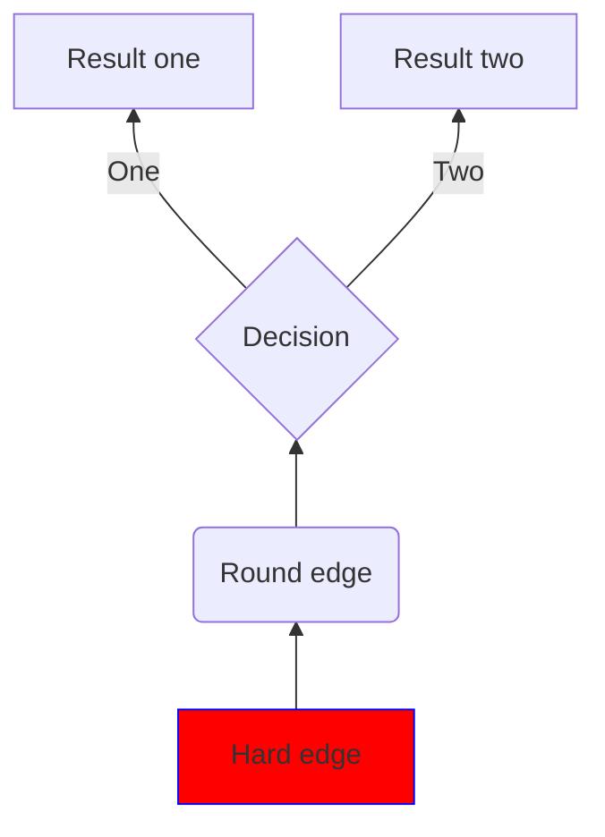

# ML
Organize Machine Learning<br>
## Reference
* [Hands-on Machine Learning(한국어)](https://github.com/Hahnnz/Hands_on_ML-Kor)
* [Python code for coursera lecture of Andrew Ng](https://github.com/JWarmenhoven/Coursera-Machine-Learning)
* [Deep learning bookmark](https://github.com/bbongcol/deep-learning-bookmarks)
```console
cat machine.txt
less machine.txt
for i in {1..10};
do
  echo $i;
done
```
```shell
less machine.txt
cat machine.txt
for i in {1..10};
do
  echo $i;
done
```
```bash
less machine.txt
cat machine.txt
for i in {1..10};
do
  echo $i;
done
```
```
less machine.txt
cat machine.txt
for i in {1..10};
do
  echo $i;
done
```
```javascript
var name = "zzz"
for(var i=0; i<10; i++){
  console.log(i)
}
```
```python
name = "zzz"
for i in range(10):
  print(i)
```



```python
def name(col):
    return col
